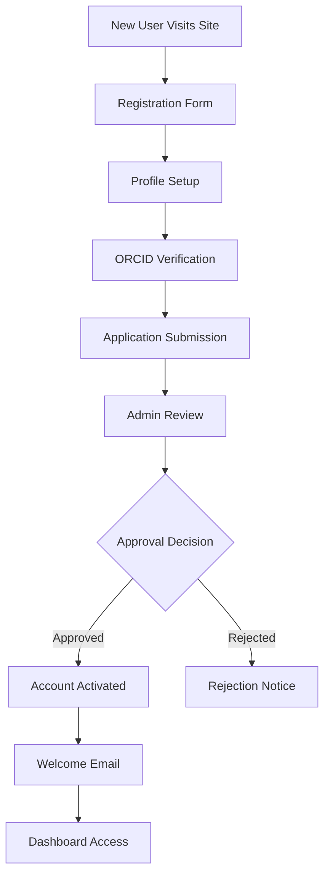
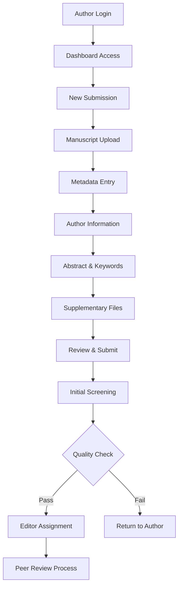
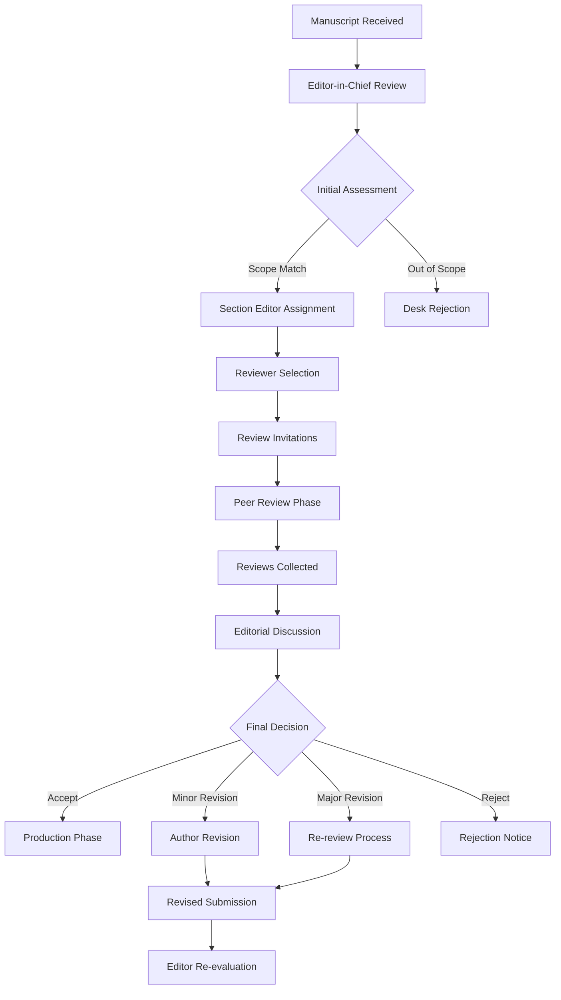
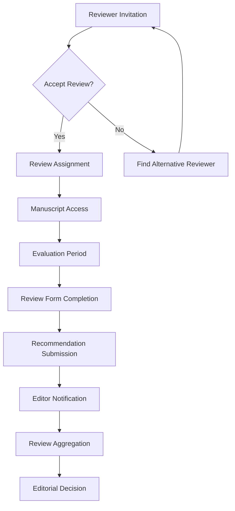
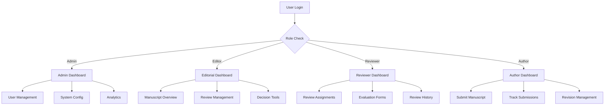
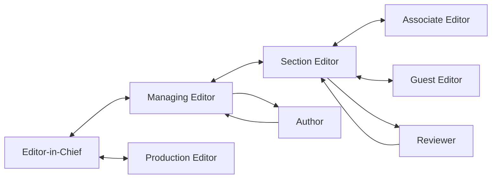
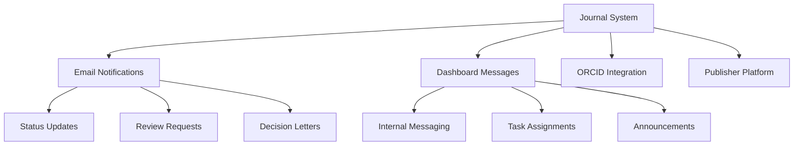

# 📋 Academic Journal Workflow Documentation

## System Flow Overview

### 1. **User Onboarding Flow**



---

### 2. **Manuscript Submission Flow**



---

### 3. **Editorial Decision Flow**



---

### 4. **Peer Review Process**



---

### 5. **Role-Based Access Control**



---

## Role Responsibilities Matrix

### Administrative Roles

| Function | System Admin | Editor-in-Chief | Managing Editor |
|----------|-------------|-----------------|-----------------|
| User Management | ✅ Full Control | ✅ Editorial Team | ❌ |
| System Configuration | ✅ | ❌ | ❌ |
| Final Editorial Decisions | ❌ | ✅ | ✅ (Delegated) |
| Policy Setting | ✅ | ✅ | ✅ (Input) |
| Financial Oversight | ✅ | ✅ | ❌ |

### Editorial Roles

| Function | Section Editor | Production Editor | Guest Editor | Associate Editor |
|----------|----------------|-------------------|--------------|------------------|
| Manuscript Assignment | ✅ (In Field) | ❌ | ✅ (Special Issues) | ✅ (General) |
| Reviewer Selection | ✅ | ❌ | ✅ | ✅ |
| Quality Control | ✅ | ✅ | ✅ | ✅ |
| Production Oversight | ❌ | ✅ | ❌ | ❌ |
| Special Issues | ❌ | ❌ | ✅ | ❌ |

### Review & Author Roles

| Function | Reviewer | Author |
|----------|----------|---------|
| Manuscript Evaluation | ✅ | ❌ |
| Submission Rights | ❌ | ✅ |
| Revision Submission | ❌ | ✅ |
| Review Assignment | ✅ | ❌ |

---

## Communication Flow

### Internal Editorial Communication



### External Communication



---

## Status Tracking System

### Application Status Flow
```
Registration → Pending → Under Review → Approved/Rejected → Active
```

### Manuscript Status Flow
```
Submitted → Initial Review → Under Review → 
In Revision → Re-review → Decision → 
Accepted/Rejected → Production → Published
```

### Review Status Flow
```
Invited → Accepted → In Progress → 
Completed → Submitted → Reviewed by Editor
```

---

## Dashboard Features by Role

### Admin Dashboard Features
- 👥 **User Management**: Create, edit, deactivate accounts
- 📊 **System Analytics**: Performance metrics, usage stats
- ⚙️ **Configuration**: System settings, role permissions
- 🔒 **Security**: Access logs, security settings
- 📈 **Reports**: Custom reports, data exports

### Editor-in-Chief Dashboard Features
- 📋 **Editorial Oversight**: All manuscript tracking
- 👨‍💼 **Team Management**: Editorial team coordination
- 📊 **Performance Metrics**: Journal performance analytics
- 📝 **Policy Management**: Editorial policies and guidelines
- 🎯 **Strategic Planning**: Long-term journal direction

### Managing Editor Dashboard Features
- 📄 **Daily Operations**: Manuscript flow management
- ⏰ **Timeline Monitoring**: Deadline tracking and alerts
- 👥 **Reviewer Coordination**: Reviewer database management
- 📞 **Communication Hub**: Editorial team communication
- 🔄 **Workflow Optimization**: Process improvement tools

### Section Editor Dashboard Features
- 🔬 **Subject Expertise**: Field-specific manuscript handling
- 👨‍🔬 **Specialist Network**: Subject matter expert reviewers
- 📊 **Field Analytics**: Subject area performance metrics
- 🎯 **Expertise Matching**: Author-reviewer alignment tools

### Production Editor Dashboard Features
- 📖 **Publication Pipeline**: Production workflow management
- ✅ **Quality Assurance**: Final publication checks
- 📐 **Format Compliance**: Style and format validation
- 📅 **Schedule Management**: Publication timeline coordination

### Reviewer Dashboard Features
- 📝 **Active Reviews**: Current review assignments
- 📚 **Review History**: Past review track record
- ⭐ **Expertise Profile**: Research specialization management
- 📊 **Performance Metrics**: Review quality metrics

### Author Dashboard Features
- 📤 **Submission Portal**: Manuscript submission interface
- 📊 **Tracking System**: Submission status monitoring
- 🔄 **Revision Management**: Response to reviewer comments
- 📞 **Communication Center**: Editorial correspondence
- 📈 **Publication History**: Author publication record

---

## Data Flow Architecture

### User Authentication Flow
```
Login Request → Credential Validation → bcrypt Verification → 
Session Creation → Role Assignment → Dashboard Redirect
```

### Database Operations Flow
```
API Request → Input Validation → Role Authorization → 
Database Query → Data Processing → Response Formatting → 
Client Response
```

### File Upload Flow
```
File Selection → Validation (type/size) → Secure Upload → 
Database Reference → Storage Confirmation → User Notification
```

---

## Security & Privacy Flow

### Access Control
```
User Request → Authentication Check → Role Verification → 
Resource Authorization → Action Logging → Response
```

### Data Protection
```
Sensitive Data → Encryption → Secure Storage → 
Access Logging → Regular Backups → Audit Trail
```

---

**Document Version**: 1.0  
**Last Updated**: August 10, 2025  
**System Status**: ✅ Operational
