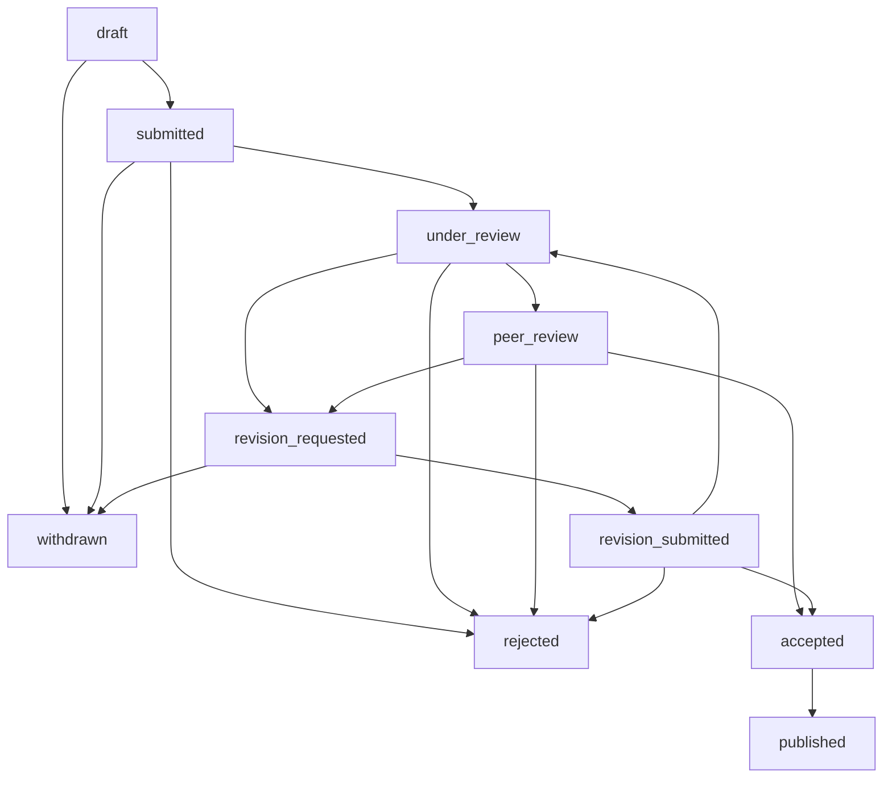

# 📋 Academic Journal Submission Review and Approval Workflow

**Document Version:** 1.0  
**Last Updated:** August 11, 2025  
**System:** African Medical and Health Sciences Journal (AMHSJ)

---

## 🎯 Overview

This document provides a comprehensive guide to the submission review and approval workflow implemented in the AMHSJ academic journal management system. The workflow encompasses the entire manuscript lifecycle from initial submission to final publication, ensuring academic rigor, efficient processing, and transparent communication.

## 📊 Workflow State Machine

### Status Definitions

| Status | Description | Stakeholder Actions |
|--------|-------------|-------------------|
| `draft` | Manuscript being prepared | Author editing |
| `submitted` | Initial submission received | System validation |
| `under_review` | Editorial initial review | Editor assessment |
| `peer_review` | Sent to peer reviewers | Reviewer evaluation |
| `revision_requested` | Changes required | Author revision |
| `revision_submitted` | Revised version received | Re-review process |
| `accepted` | Approved for publication | Production preparation |
| `rejected` | Not suitable for publication | Process concluded |
| `published` | Available to public | Indexing and distribution |
| `withdrawn` | Author/editor withdrawal | Process terminated |

### Valid State Transitions



---

## 🔄 Detailed Workflow Phases

### Phase 1: Initial Submission

#### 1.1 Author Submission Process

**Requirements:**
- Completed manuscript file (PDF/DOC)
- Title and abstract (required)
- Keywords (minimum 3)
- Category selection
- Author information and affiliations
- Co-author details (if applicable)

**System Actions:**
```typescript
// Automatic validation and processing
1. Validate required fields
2. Generate unique submission ID
3. Create article and submission records
4. Set initial status: "submitted"
5. Send confirmation email to author
6. Trigger editor assignment algorithm
```

**Notifications:**
- Author: Submission confirmation with tracking ID
- System: New submission alert to editorial team

#### 1.2 Automated Editor Assignment

**Assignment Algorithm:**
```typescript
findSuitableEditor(category) {
  criteria = {
    - Category/specialty matching
    - Current workload vs capacity
    - Active status and availability
    - Assigned editorial sections
    - Performance metrics
  }
  
  return editor_with_lowest_workload_in_specialty
}
```

**Assignment Process:**
1. Query active editors with matching specialties
2. Check workload capacity (current < maximum)
3. Sort by workload and expertise match
4. Assign to most suitable editor
5. Update article with editor assignment
6. Send notification to assigned editor

---

### Phase 2: Editorial Review

#### 2.1 Initial Editorial Assessment

**Editor Responsibilities:**
- Scope and journal fit evaluation
- Technical quality assessment
- Ethical compliance review
- Plagiarism screening
- Format and submission guideline compliance

**Decision Options:**
```typescript
EditorialDecisions = {
  PROCEED_TO_REVIEW: "peer_review",
  DESK_REJECT: "rejected", 
  REQUEST_REVISION: "revision_requested"
}
```

#### 2.2 Editorial Decision Process

**Proceed to Peer Review:**
- Status: `submitted` → `peer_review`
- Trigger reviewer assignment algorithm
- Set review timeline (default: 21 days)
- Create review invitation notifications

**Desk Rejection:**
- Status: `submitted` → `rejected`
- Send decision notification to author
- Include editorial feedback
- Process concluded

**Revision Request:**
- Status: `submitted` → `revision_requested`
- Send detailed revision requirements
- Set revision deadline
- Author response awaited

---

### Phase 3: Reviewer Assignment

#### 3.1 Intelligent Reviewer Selection

**Selection Criteria:**
```typescript
ReviewerSelectionAlgorithm = {
  expertise_matching: {
    - Keywords overlap analysis
    - Research area alignment
    - Publication history relevance
  },
  
  availability_check: {
    - Current review workload
    - Maximum reviews per month
    - Availability status
    - Response rate history
  },
  
  conflict_detection: {
    - Author-reviewer institution overlap
    - Co-authorship history
    - Personal/professional conflicts
    - Geographic proximity rules
  },
  
  quality_metrics: {
    - Review completion rate
    - Review quality scores
    - Timeliness history
    - Editorial feedback scores
  }
}
```

#### 3.2 Assignment Process

**System Workflow:**
```typescript
async assignReviewers(articleId, editorId) {
  1. Query eligible reviewers by expertise
  2. Filter by availability and workload
  3. Remove conflicted reviewers
  4. Rank by quality metrics
  5. Select top 2-3 reviewers
  6. Create review records
  7. Send invitation emails
  8. Set review deadlines
  9. Update reviewer workload
  10. Notify editor of assignments
}
```

**Review Invitation Content:**
- Article title and abstract
- Review deadline (typically 21 days)
- Review guidelines and criteria
- Access to manuscript files
- Confidentiality agreement

---

### Phase 4: Peer Review Process

#### 4.1 Review Execution

**Reviewer Actions:**
```typescript
ReviewSubmission = {
  recommendation: "accept" | "minor_revision" | "major_revision" | "reject",
  public_comments: "Feedback for authors",
  confidential_comments: "Private notes for editor",
  quality_rating: 1-5_scale,
  review_criteria: {
    - Novelty and significance
    - Methodology rigor
    - Data quality and analysis
    - Writing clarity
    - Literature review completeness
  }
}
```

#### 4.2 Review Monitoring

**Automated Tracking:**
```typescript
ReviewMonitoring = {
  deadline_reminders: [
    "7 days before deadline",
    "3 days before deadline", 
    "1 day before deadline"
  ],
  
  overdue_handling: {
    - Mark review as "overdue"
    - Send urgent reminders
    - Update reviewer performance metrics
    - Trigger backup reviewer assignment
  },
  
  quality_assurance: {
    - Minimum comment length validation
    - Recommendation consistency checks
    - Timeline compliance tracking
  }
}
```

---

### Phase 5: Review Completion and Editorial Decision

#### 5.1 Review Aggregation

**Decision Algorithm:**
```typescript
determineArticleStatus(reviewRecommendations) {
  if (recommendations.includes("reject")) {
    return "rejected"
  }
  
  if (recommendations.includes("major_revision")) {
    return "revision_requested"
  }
  
  if (recommendations.includes("minor_revision")) {
    return "revision_requested"
  }
  
  if (recommendations.every(r => r === "accept")) {
    return "accepted"
  }
  
  // Mixed recommendations require editorial decision
  return "under_editorial_review"
}
```

#### 5.2 Editorial Decision Making

**Editor Review Process:**
1. Analyze all reviewer comments and recommendations
2. Assess consistency and quality of reviews
3. Consider journal fit and standards
4. Make final editorial decision
5. Prepare decision letter with consolidated feedback

**Decision Communication:**
```typescript
EditorialDecisionNotification = {
  decision_types: ["accept", "minor_revision", "major_revision", "reject"],
  
  notification_content: {
    - Final decision and rationale
    - Consolidated reviewer feedback
    - Specific revision requirements (if applicable)
    - Timeline expectations
    - Next steps guidance
  }
}
```

---

### Phase 6: Revision Workflow

#### 6.1 Revision Request Processing

**Author Response Options:**
- Submit revised manuscript with response letter
- Withdraw submission
- Request deadline extension

**Revision Requirements:**
```typescript
RevisionPackage = {
  revised_manuscript: "Updated document",
  response_letter: "Point-by-point response to reviewers",
  change_tracking: "Highlighted modifications",
  additional_data: "Supplementary materials if requested"
}
```

#### 6.2 Re-review Process

**Re-review Decision Matrix:**
```typescript
ReReviewProcess = {
  minor_revisions: {
    reviewer_assignment: "Same reviewers (if available)",
    timeline: "10-14 days",
    scope: "Verification of requested changes"
  },
  
  major_revisions: {
    reviewer_assignment: "Same or new reviewers",
    timeline: "21-28 days", 
    scope: "Full re-evaluation"
  }
}
```

---

### Phase 7: Acceptance and Publication

#### 7.1 Acceptance Process

**Post-Acceptance Workflow:**
```typescript
AcceptanceWorkflow = {
  immediate_actions: [
    "Send acceptance notification",
    "Initiate DOI registration", 
    "Schedule production timeline",
    "Request copyright transfer"
  ],
  
  production_steps: [
    "Copyediting and formatting",
    "Author proof review",
    "Final corrections",
    "Publication scheduling"
  ]
}
```

#### 7.2 Publication Process

**Publication Pipeline:**
1. Final manuscript preparation
2. DOI assignment and registration
3. Metadata creation for indexing
4. Online publication
5. Distribution to indexing services
6. Author and stakeholder notifications

---

## 🔔 Notification System

### Email Notifications

| Trigger Event | Recipients | Template | Timing |
|---------------|------------|----------|---------|
| Submission Received | Author | `submissionConfirmation` | Immediate |
| Editor Assignment | Editor | `editorAssignment` | Immediate |
| Review Invitation | Reviewer | `reviewInvitation` | Immediate |
| Review Reminder | Reviewer | `reviewReminder` | 7, 3, 1 days before |
| Review Completed | Editor, Author | `reviewCompleted` | Immediate |
| Editorial Decision | Author | `editorialDecision` | Immediate |
| Revision Request | Author | `revisionRequest` | Immediate |
| Acceptance | Author | `manuscriptAccepted` | Immediate |
| Publication | Author, Stakeholders | `publicationNotice` | Upon publication |

### In-App Notifications

```typescript
NotificationTypes = {
  SUBMISSION_RECEIVED: "New submission confirmation",
  REVIEW_ASSIGNED: "New review assignment", 
  REVIEW_REMINDER: "Review deadline approaching",
  REVIEW_COMPLETED: "Review submitted successfully",
  EDITORIAL_DECISION: "Decision available",
  REVISION_REQUESTED: "Revisions required",
  MANUSCRIPT_ACCEPTED: "Manuscript accepted",
  PUBLICATION_LIVE: "Article published"
}
```

---

## 📊 Performance Metrics and Quality Assurance

### Key Performance Indicators

```typescript
WorkflowMetrics = {
  submission_to_first_decision: "Target: 8-12 weeks",
  review_completion_rate: "Target: >95%",
  reviewer_response_time: "Target: <21 days",
  editorial_decision_time: "Target: <14 days post-review",
  revision_cycle_time: "Target: <6 weeks",
  acceptance_to_publication: "Target: <8 weeks"
}
```

### Quality Assurance Measures

**Automated Monitoring:**
- Review deadline compliance tracking
- Reviewer performance analytics
- Editorial decision timeline monitoring
- Author satisfaction surveys
- Stakeholder feedback collection

**Escalation Procedures:**
```typescript
EscalationMatrix = {
  overdue_reviews: {
    day_7: "Gentle reminder",
    day_14: "Urgent reminder + backup assignment",
    day_21: "Replace reviewer + editor notification"
  },
  
  stalled_submissions: {
    week_12: "Status inquiry to editor",
    week_16: "Editorial board review",
    week_20: "Editor-in-chief intervention"
  }
}
```

---

## 🛠️ Technical Implementation

### Database Schema Overview

```sql
-- Core workflow tables
articles (id, title, abstract, status, author_id, editor_id, ...)
submissions (id, article_id, status, status_history, ...)
reviews (id, article_id, reviewer_id, status, recommendation, ...)
notifications (id, user_id, type, message, is_read, ...)

-- User management
users (id, email, name, role, ...)
reviewer_profiles (user_id, availability, max_reviews, ...)
editor_profiles (user_id, assigned_sections, workload, ...)

-- Communication
conversations (id, type, participants, ...)
messages (id, conversation_id, sender_id, content, ...)
```

### API Endpoints

```typescript
// Submission management
POST /api/submissions                    // Create new submission
GET  /api/submissions/:id               // Get submission details
PUT  /api/submissions/:id/status        // Update submission status

// Review management  
POST /api/reviews/:id/assign            // Assign reviewers
PUT  /api/reviews/:id/submit            // Submit review
GET  /api/reviews/overdue               // Get overdue reviews

// Editorial decisions
POST /api/editorial/:id/decision        // Make editorial decision
GET  /api/editorial/pending             // Get pending decisions

// Notifications
GET  /api/notifications                 // Get user notifications
PUT  /api/notifications/:id/read        // Mark as read
```

---

## 🔧 Configuration and Customization

### Workflow Configuration

```typescript
WorkflowConfig = {
  review_deadlines: {
    initial_review: 21,        // days
    revision_review: 14,       // days
    major_revision_review: 28  // days
  },
  
  assignment_limits: {
    max_reviewers_per_article: 4,
    max_reviews_per_reviewer_month: 3,
    min_reviewers_required: 2
  },
  
  notification_timing: {
    reminder_days_before: [7, 3, 1],
    escalation_days_after: [7, 14, 21]
  }
}
```

### Role-Based Permissions

```typescript
Permissions = {
  author: ["submit", "revise", "view_own_submissions"],
  reviewer: ["accept_reviews", "submit_reviews", "view_assigned"],
  editor: ["assign_reviewers", "make_decisions", "view_section"],
  admin: ["manage_users", "view_all", "system_config"]
}
```

---

## 📚 Troubleshooting and Support

### Common Issues and Solutions

| Issue | Symptoms | Resolution |
|-------|----------|------------|
| Reviewer Not Responding | No review after deadline | Auto-assign backup reviewer |
| Editorial Delay | Decision pending >14 days | Escalate to editor-in-chief |
| Author Non-Response | No revision after 60 days | Mark as withdrawn |
| System Notifications Failed | Users not receiving emails | Check email service status |

### Support Contacts

- **Technical Issues:** system-admin@amhsj.org
- **Editorial Queries:** editorial-office@amhsj.org  
- **General Support:** support@amhsj.org

---

## 📈 Future Enhancements

### Planned Improvements

1. **AI-Powered Reviewer Matching**
   - Semantic analysis of manuscript content
   - Machine learning-based recommendation system
   - Predictive reviewer performance modeling

2. **Advanced Analytics Dashboard**
   - Real-time workflow monitoring
   - Predictive deadline analysis
   - Performance benchmarking

3. **Enhanced Communication Tools**
   - Video conference integration
   - Collaborative annotation system
   - Real-time chat functionality

4. **Mobile Application**
   - Reviewer mobile app
   - Push notifications
   - Offline review capability

---

## 📄 Document Control

| Version | Date | Author | Changes |
|---------|------|--------|---------|
| 1.0 | 2025-08-11 | System Documentation | Initial comprehensive documentation |

---

**For technical support or questions about this workflow, please contact the AMHSJ technical team or refer to the developer documentation.**
